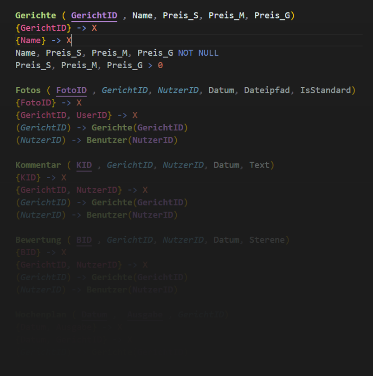
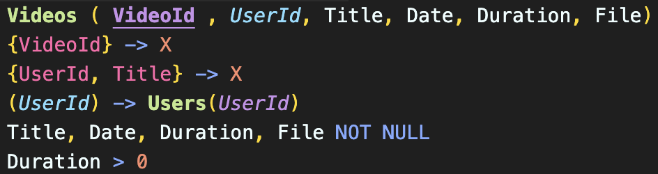

# Syntax Highlighting — Formaler Syntax für Relationalen Entwurf 
> An der [Hochschule Kaiserslautern](https://hs-kl.de) wird zur Lehre von SQL & Datenmodellierung die Platform [DBcoach](https://dbcoach.hs-kl.de/) eingesetzt.\
> Diese umfasst unter anderem einen **Formaler Syntax** zur Darstellung des Relationalen Entwürfe.\
> Diese Erweiterung sorgt für eine farbliche hervorheben des Formalen Syntaxes.


## 🎓 Syntax-Guide & Farben
Damit das Highlighting funktioniert, nutze folgende Schreibweisen:
| Bezeichnung | Syntax | Info | Screenshot |
| :--- | :--- | :--- | :--- |
| **Tabellenname** | `Tabelle (...)` | Schreibe den Tabellennamen gefolgt von Klammern |  |
| **Primärschlüssel** | `_Name_` | Schreibe ein `_` vor und hinter den Primärschlüssel |  |
| **Fremdschlüssel** | `..Id` oder `..ID` | Ein Fremdschlüssel muss auf `ID` oder `id` enden |  |
| **Schlüsselkandidat** | `{Name}` | Die Schlüsselkandidaten mussen in zwischen `{}` stehen |  |
| **Integritätsbedingungen** | `NOT NULL` , `CHECK`| Aktuell werden nur diese 2 Integritätsbedingungen unterstüzt. |  |

*Der Syntax stimmt mit dem Formalen Syntax aus DBcoach überein.*\
*Die einzigste Ausnahme ist die Endung der Fremdschlüssel, diese muss technisch bedingt exact so geschrieben werden!*

##### Hier ein Screenshot des Farbschemas:



## 🚀 Installation
### Über den VS Code Marketplace
1. Öffne VS Code.
2. Gehe links auf das Erweiterungen-Icon (oder drücke Strg+Shift+X)
3. Suche nach `DBcoach` oder `RSN`.
4. Installiere: `DBcoach — Formaler Syntax für Relationalen Entwurf`

### Manuelle Installation (.vsix)
Falls du die .vsix-Datei direkt von jemandem bekommen hast:
1. Speichere die Datei rsn-highlighter-1.0.0.vsix auf deinem PC.
2. Öffne VS Code und gehe zu Erweiterungen (Strg+Shift+X).+
3. Klicke oben rechts im Menü auf die drei Punkte (...).
4. Wähle "Install from VSIX..." (VSIX aus Datei installieren).
5. Wähle die Datei aus. Fertig!


## 📝 Beispiel Code

Hier ist ein Auszug aus der Lösung der Menaplan Aufgabe aus dem DBcoach.\
Erstelle eine Datei mit der Endung **.rsn** und kopiere diesen Text hinein.\
Er sollte nun so dargestellt werden wie auf dem Screenshot.

```rsn
Gerichte (_GerichtID_, Name, Preis_S, Preis_M, Preis_G)
{GerichtID} -> X
{Name} -> X
Name, Preis_S, Preis_M, Preis_G NOT NULL
Preis_S, Preis_M, Preis_G > 0

Fotos (_FotoID_, GerichtID, NutzerID, Datum, Dateipfad, IsStandard)
{FotoID} -> X
{GerichtID, UserID} -> X
(GerichtID) -> Gerichte(GerichtID)
(NutzerID) -> Benutzer(NutzerID)
```

#
> [!NOTE]
> Wenn euch Fehler auffallen oder Ihr Verbesserungsvorschläge habt, wendet euch bitte direkt an mich.\
> Die Dozenten haben mit diesem Projekt nichts zu tun.

> [!IMPORTANT]
> **Rechtlicher Hinweis / Disclaimer**\
> Dies ist ein inoffizielles Projekt von Studenten für Studenten. \
> Diese Erweiterung steht in keinerlei Verbindung zu den Entwicklern von DBCoach.\
> Die Nutzung des Namens "DBCoach" dient lediglich der Beschreibung des Verwendungszwecks.

